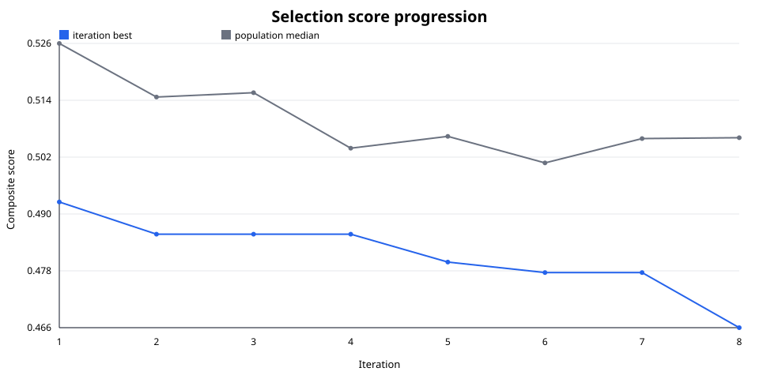
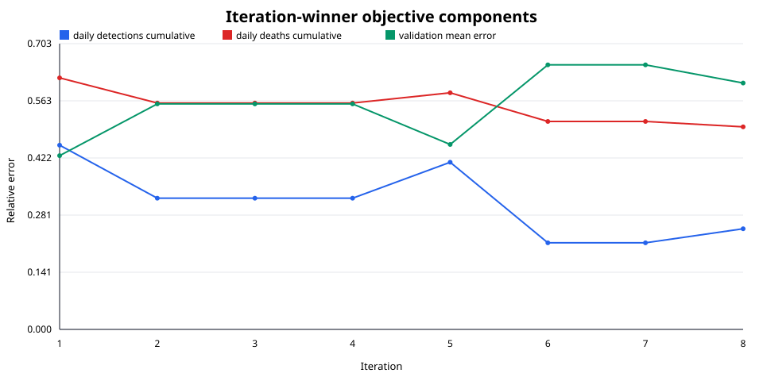
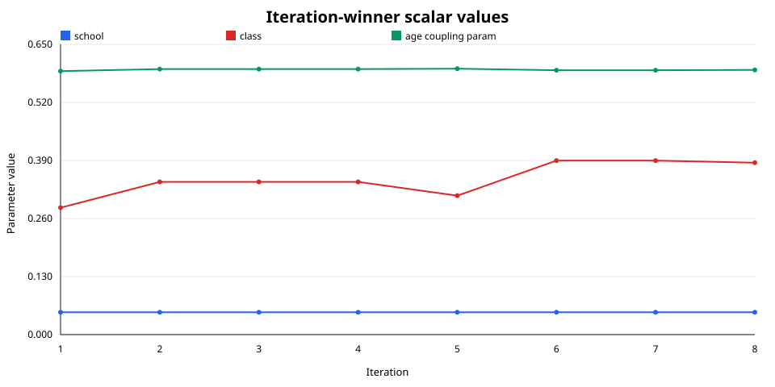

# Audit of `saxony-corrected-phase1-scalars-v2`

Audit date: 2026-09-23  
Source: <https://github.com/marcinb-pwr/saxony-corrected-phase1-scalars-v2>  
Source commit: `58fb26686750d4066450a1c745c07446152791da`

## Executive finding

The scalar-only run completed eight iterations and all 96 candidate evaluations.
Its best result is iteration 8, candidate 11, with composite selection score
`0.466424`. This is a real but modest improvement: the iteration-best score fell
5.35% from `0.492777` in iteration 1, while the population median fell only 3.76%
from `0.526014` to `0.506255`.

The result should be treated as a useful Phase 1 handoff, not a satisfactory
calibration. The winner's training-window relative cumulative errors are 24.78%
for detections and 49.85% for deaths, and its rolling validation error is 60.63%.
Only 6 of 96 candidates reached the lowest (`0.5`) quality-gate level; none is
reported at a stronger level. The best point therefore sits exactly at the
minimum declared gate rather than demonstrating a robust fit.



## Iteration results

The score is the configured composite
`0.3 × detection cumulative error + 0.3 × death cumulative error + 0.4 × rolling validation mean error`.
Repeated winners in iterations 2--4 and 6--7 are consistent with incumbent
preservation: they are not evidence of new improvement in those iterations.

| Iteration | Best candidate | Best score | Median score | Detection cumulative | Death cumulative | Validation mean |
|---:|---:|---:|---:|---:|---:|---:|
| 1 | 9 | 0.492777 | 0.526014 | 0.453460 | 0.619069 | 0.427545 |
| 2 | 8 | 0.486027 | 0.514770 | 0.322897 | 0.557147 | 0.555034 |
| 3 | 12 | 0.486027 | 0.515688 | 0.322897 | 0.557147 | 0.555034 |
| 4 | 12 | 0.486027 | 0.504053 | 0.322897 | 0.557147 | 0.555034 |
| 5 | 1 | 0.480178 | 0.506524 | 0.411382 | 0.582304 | 0.455180 |
| 6 | 1 | 0.477977 | 0.500968 | 0.213204 | 0.511870 | 0.651137 |
| 7 | 12 | 0.477977 | 0.506071 | 0.213204 | 0.511870 | 0.651137 |
| 8 | 11 | **0.466424** | 0.506255 | 0.247768 | 0.498537 | 0.606332 |



The components expose the trade-off hidden by the scalar score. From iteration
1 to 8 the cumulative terms improve substantially, but validation error worsens
from `0.427545` to `0.606332`. Across all candidates, score correlation is
`0.439` with detection cumulative error, `0.494` with death cumulative error,
but only `0.073` with validation error. These are descriptive correlations, not
causal sensitivity estimates.

## Scalar behavior

The winning scalar triple is:

| Parameter | Winner | Population range | Correlation with score |
|---|---:|---:|---:|
| `school` | **0.050000** | 0.050000--0.078473 | 0.097 |
| `class` | **0.384935** | 0.198618--0.400000 | -0.348 |
| `age_coupling_param` | **0.592748** | 0.590000--0.605317 | 0.383 |



`school` is boundary-limited: it equals its observed lower bound of `0.05` in
58 of 96 candidates and in every iteration winner. This suggests that Phase 2
should not interpret `0.05` as a well-identified interior optimum. `class`
explores most of its apparent allowed range and moves upward in later winners.
`age_coupling_param` moves over a very narrow range; its correlation must not be
read as causal because CMA-ES perturbed the three parameters jointly.

The final normalized sigmas are `(0.07164, 0.20000, 0.03573)` in state-vector
order `(age coupling, class, school)`. `class` remains at the configured `0.20`
sigma ceiling, while the boundary-limited `school` direction has contracted.
This is further evidence that the scalar profile is not fully settled.

## Validation and artifact audit

The repository labels validation `passed` for seeds 42, 43, and 44, but all
three recorded scores are exactly `400.8344754710868` (`std_score = 0`). That
shows reproducibility of the published evaluation, but provides no observed
between-seed variability. Before promoting the handoff, verify that the
simulator actually consumes the replicate seed and run multiple stochastic
trajectories per scalar triple.

The validation score is also on a different scale from the `0.466424` selection
score. The winner stores a negative-binomial log likelihood near `399.831`, so
the replicate score near `400.834` is evidently not the weighted selection
composite. Reports should label those quantities explicitly instead of comparing
them as if they shared a scale.

The published `final_best_candidate.json` and
`phase1_scalar_6m_best_candidate.json` agree with iteration 8 candidate 11 for
the three fitted scalars. The stage summary also identifies `0.466424` as the
best score. Unlike the earlier corrected tournament snapshot, this repository's
final-candidate bookkeeping is internally consistent.

## Recommendation

1. Carry iteration 8 candidate 11 into Phase 2, but retain several nearby
   archive candidates rather than declaring the scalar triple identified.
2. Treat `school = 0.05` as censored by the lower bound. Either justify that
   scientific bound or run a small profile that extends below it.
3. Continue fitting modulation vectors because the validation-vs-cumulative
   trade-off remains large; compare Phase 2 against this Phase 1 baseline using
   each component, not only the composite.
4. Re-run validation with confirmed seed propagation and multiple trajectories.
   Require non-degenerate replicate evidence before making robustness claims.
5. Watch `class`: its final CMA sigma is still at the ceiling, so the next joint
   refinement should not freeze it permanently at `0.384935`.

## Reproduction

The audit utility uses only the Python standard library. It joins each history
entry to its candidate `config.json`, calculates per-iteration winners, medians,
Pearson correlations and gate counts, and emits the JSON summary plus the three
SVG figures used above.

```sh
python3 drawing-utilities/audit_phase1_scalars.py \
  --results /path/to/saxony-corrected-phase1-scalars-v2 \
  --output docs/assets/saxony-corrected-phase1-scalars-v2
```

The generated `audit_summary.json` is the machine-readable record behind the
tables and findings. Correlations are observational and confounded by the joint
CMA population; they must not be interpreted as parameter effects.
